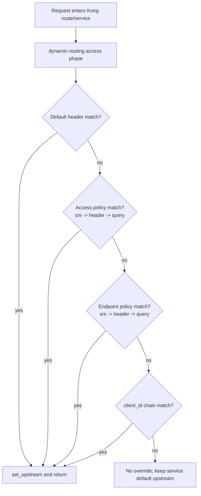

# Dynamic Routing Plugin: Code Walkthrough (Core Functionality)

This document provides a code-level walkthrough of the plugin implementation, focused on how request routing decisions are made end to end.

## Scope

- Core runtime file: `kong/plugins/dynamic-routing/handler.lua`
- Config contract: `kong/plugins/dynamic-routing/schema.lua`
- Local runtime mapping example: `config/kong.yml`

## High-Level Request Lifecycle

## Line-by-Line Walkthrough (`handler.lua`)

### 1) Module setup and constants

- Lines `1-3`: imports `kong`, `ngx`, and safe JSON parser `cjson.safe`.
- Lines `5-11`: plugin metadata; `PRIORITY = 800` so this runs in `access` with intended ordering behind auth enrichment.
- Lines `18-24`: selector/config constants:
  - policy keys (`sni`, `header_name`, `query_param_name`)
  - defaults for header names
  - consumer tag prefix `upstream_env:`.

### 2) Utility helpers for safe value handling

- Lines `26-28`: `is_non_empty_string(v)` avoids blank or non-string values.
- Lines `30-44`: `first_non_empty_string(value)`:
  - returns value directly if valid string
  - if table, returns first valid non-empty entry
  - supports multi-value headers/query args safely.

### 3) Consumer fallback extraction

- Lines `85-105`: `get_consumer_upstream_env(consumer)`:
  - scans `consumer.tags`
  - finds first tag prefix `upstream_env:`
  - returns suffix (for example `qa` from `upstream_env:qa`).

### 4) Upstream lookup primitives

- Lines `107-122`: `get_upstream_by_names(names, upstreams)`:
  - iterates candidate selector keys
  - returns first mapping found in `cfg.upstreams`.
- Lines `124-136`: lookup via default header (`X-Upstream-Env` by default).
- Lines `138-154`: lookup via TLS SNI (`ngx.var.ssl_server_name`) when enabled.
- Lines `156-168`: lookup via configured request header.
- Lines `170-182`: lookup via configured query param.

### 5) Policy resolver and context tagging

- `resolve_policy_upstream(policy, upstreams, policy_name)`:
  - validates each policy independently:
    - if `policy` is `nil`, skip silently
    - if `policy` is not a table, skip that policy with debug log
    - if policy has no `sni/header/query` selector configured, skip that policy with debug log
  - evaluates in strict order: `sni` -> `header` -> `query`
  - returns `(upstream_name, selector_key, reason)` where reason is:
    - `access_policy_sni`, `access_policy_header`, `access_policy_query`
    - `endpoint_sni`, `endpoint_header`, `endpoint_query`.
- `set_upstream(...)`:
  - calls `kong.service.set_upstream(upstream_name)`
  - stores observability metadata in `kong.ctx.plugin`:
    - `upstream_backend_id`
    - `upstream_selector_reason`
    - `upstream_selector_key`.

### 6) Client-id fallback chain

- `get_client_id(cfg)` resolves from authenticated `consumer.username`.

### 7) Core execution path: `access(cfg)`

- Lines `272-282`: start of `access` phase; returns early if config is not a table.
- Lines `284-288`: requires `cfg.upstreams` map; returns if missing.
- Lines `290-297`: priority #1 default-header lookup.
  - on match: sets upstream and exits.
- next: evaluate `access_policy` first and `endpoint` second.
  - each policy is self-validated inside `resolve_policy_upstream`
  - invalid/empty one does not block the other
  - each successful match sets upstream and exits.
- Lines `314-327`: client-id chain fallback.
  - resolves client-id
  - writes client-id to upstream request header (`kong.service.request.set_header`)
  - maps `upstreams[client_id]`; on match sets upstream and exits.
- final fallback logs default-routing debug context and continues with service default upstream.

## Exact Precedence Implemented

The plugin chooses the first successful match in this order:

1. `upstream_header_name` (default `X-Upstream-Env`)
2. `access_policy.sni`
3. `access_policy.header_name`
4. `access_policy.query_param_name`
5. `endpoint.sni`
6. `endpoint.header_name`
7. `endpoint.query_param_name`
8. client-id chain:
   - authenticated `consumer.username`

## How `schema.lua` enforces contract

In `kong/plugins/dynamic-routing/schema.lua`:

- Lines `15-20`: `config.upstreams` map is required.
- Line `23`: `upstream_header_name` has default `X-Upstream-Env`.
- Lines `25-44`: `access_policy` and `endpoint` records define optional `sni/header/query` selectors.

## How local `kong.yml` maps real traffic

In `config/kong.yml`:

- Lines `67-92`: plugin instance configuration:
  - selector header names
  - `upstreams` key-to-upstream map
  - access and endpoint selector field names
- Lines `94-142`: consumer identities and `upstream_env:*` tags support fallback routing.

## End-to-End Example (Concrete)

Input request:

- no `X-Upstream-Env`
- `X-Upstream-Env-AP: unknown`
- `X-Upstream-Env-EP: qa`
- no `client_id`

Execution:

1. Default header check fails.
2. Access policy SNI/header/query do not produce mapped key (`unknown`).
3. Endpoint header matches key `qa`.
4. Plugin calls `kong.service.set_upstream(<qa upstream>)`.
5. `kong.ctx.plugin` is set with:
   - `upstream_selector_reason=endpoint_header`
   - `upstream_selector_key=qa`.

## Test Evidence for Core Flow

- Unit precedence and fallback checks:
  - `spec/dynamic-routing/02-unit_spec.lua`
- Integration checks with live Kong upstream switching:
  - `spec/dynamic-routing/10-integration_spec.lua`
- Functional scenarios on local stack:
  - `tests/functional/pytest/test_dynamic_routing.py`
