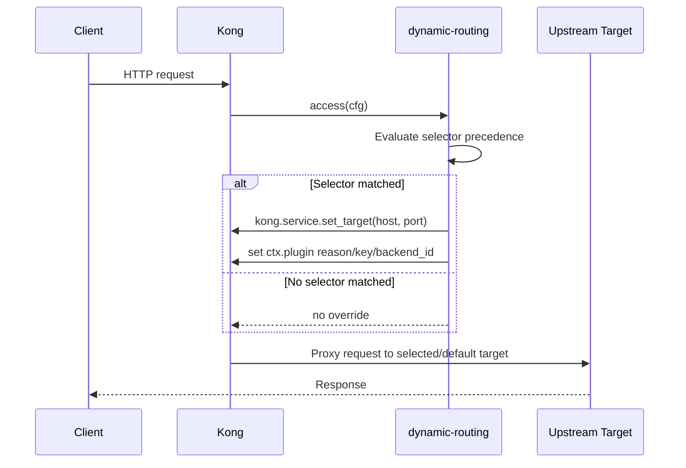

# Dynamic Routing Plugin: Code Walkthrough

This document explains the end-to-end flow of the `dynamic-routing` Kong plugin in this repository.

## 1. What this plugin does

The plugin picks a backend target at request time using selector inputs from:

1. A default header (`X-Upstream-Env`)
2. Access policy selectors (`sni`, header, query)
3. Endpoint policy selectors (`sni`, header, query)
4. Client identity fallback (`consumer.username`)

If no selector maps to `config.upstreams`, the request is not blocked. Kong uses the service default target.

## 2. Where the logic lives

- Schema: `kong/plugins/dynamic-routing/schema.lua`
- Runtime selection logic: `kong/plugins/dynamic-routing/handler.lua`
- Declarative local config example: `config/kong.yml`
- Behavior validation:
  - `spec/dynamic-routing/02-unit_spec.lua`
  - `spec/dynamic-routing/10-integration_spec.lua`
  - `tests/functional/pytest/test_dynamic_routing.py`

## 3. Runtime placement inside Kong

- Plugin priority: `PRIORITY = 800`
- Active phase: `access`
- `rewrite` and `log` phases are intentionally not implemented

Reason: upstream selection must happen before proxying, and after auth where consumer context is available.

## 4. Config model (schema-driven)

From `schema.lua`, required and key fields are:

- `config.upstreams` (required map): selector key -> backend host
- `config.upstream_ports` (required map): selector key -> backend port
- `config.upstream_header_name` (default `X-Upstream-Env`)

## 5. End-to-end request flow

```mermaid
flowchart TD
    A[Incoming request] --> B[dynamic-routing access phase]
    B --> C{Default header matches?<br/>X-Upstream-Env -> upstreams[key]}
    C -- yes --> Z[set_target and return]
    C -- no --> D{Access policy match?<br/>sni -> header -> query}
    D -- yes --> Z
    D -- no --> E{Endpoint policy match?<br/>sni -> header -> query}
    E -- yes --> Z
    E -- no --> F[Resolve client_id chain]
    F --> J{Authenticated consumer exists?}
    J -- yes --> K[Use consumer.username]
    J -- no --> L[No client_id]
    K --> M{upstreams[client_id] exists?}
    M -- yes --> Z
    M -- no --> N[No override; keep service default route]
    L --> N

    Z --> O[kong.service.set_target(mapped_host, mapped_port)]
    O --> P[Store debug metadata in kong.ctx.plugin]
```

### Sequence representation



## 6. Selector precedence (exact order)

The handler uses this strict order and exits on first successful match:

1. `upstream_header_name` (default `X-Upstream-Env`)
2. `sni`
3. `header_name`
4. `query_param_name`
5. `consumer.username`

Important behavior:
- If a higher-priority selector is present but does not exist in `config.upstreams`, the plugin continues to lower priorities.
- Header/query values can be single or multi-value. The plugin picks the first non-empty value that maps to an upstream key.

## 7. Client identity fallback chain

When selectors do not match, the plugin resolves `client_id` from authenticated `consumer.username`.
If a client id value is resolved, the plugin sets it on upstream request header `client_id`.

## 8. What gets written for observability

On successful upstream override, the plugin stores:

- `kong.ctx.plugin.upstream_backend_id` -> mapped backend `host:port`
- `kong.ctx.plugin.upstream_selector_reason` -> reason such as `default_header`, `sni`, `header`, `query`, `client_id`
- `kong.ctx.plugin.upstream_selector_key` -> matched selector key (for example `dev`, `qa_client`)

This helps trace exactly why a request was routed to a specific backend.

## 9. Pseudocode view of `access()`

```text
if cfg invalid or cfg.upstreams missing: return

if match default header:
  set_target and return

if match selectors in order sni/header/query:
  set_target and return

client_id = from consumer.username
if client_id exists:
  add/overwrite client_id to upstream request
  if cfg.upstreams[client_id] exists:
    set_target and return

log debug and keep service default routing
```

## 10. Concrete local example (`config/kong.yml`)

- Service default host: `orders_api_it:8080`
- If no selectors match, traffic stays on IT backend.
- Example key mappings:
  - `dev` -> `orders_api_dev:8080`
  - `qa_client` -> `orders_api_qa:8080`
  - `access-sni-dev.local` -> `orders_api_dev:8080`

So one request can be routed by:
- `X-Upstream-Env: dev`
- or `X-Upstream-Env-AP: dev`
- or `?apUpsByQP=dev`
- or authenticated consumer username `qa-client-app`

## 11. Why this design is predictable

- Deterministic precedence: first matching rule wins.
- Non-breaking fallback: no match does not fail request.
- Kong-native target switching: uses `kong.service.set_target`.
- Test-backed behavior: schema + unit + integration + functional suites validate precedence and fallback.

## 12. Quick debugging checklist

1. Confirm plugin is attached to the service/route being hit.
2. Confirm selector key exists in `config.upstreams` exactly.
3. Confirm higher-priority selectors are not unintentionally set.
4. Verify authenticated consumer context exists when expecting username-based fallback.
5. Check `kong.ctx.plugin` fields (or logs) for selector reason and key.
